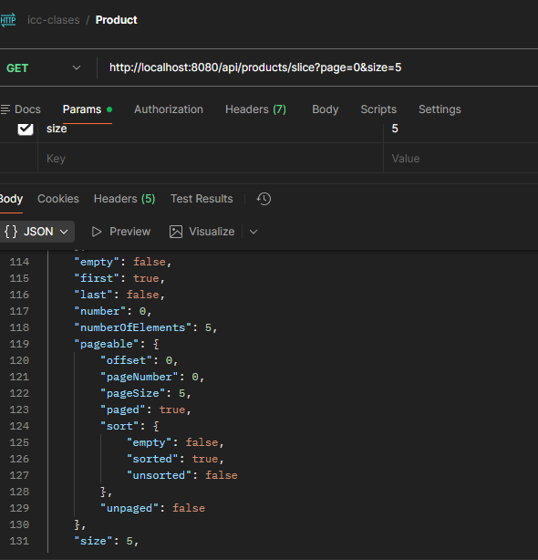
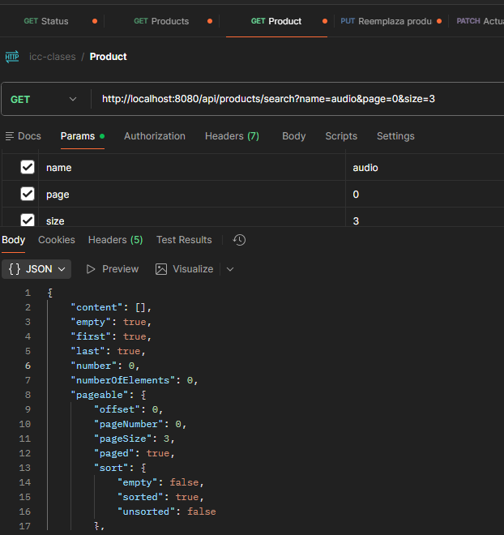
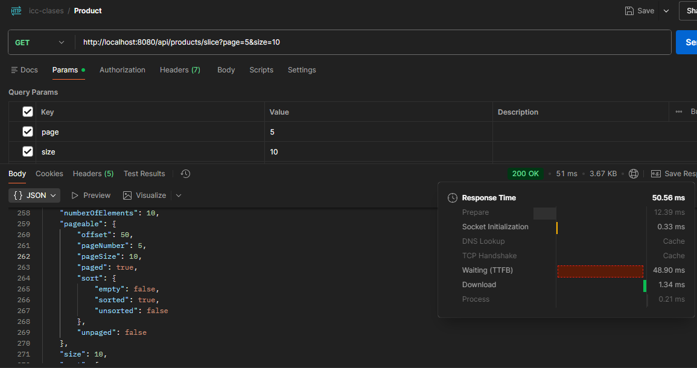
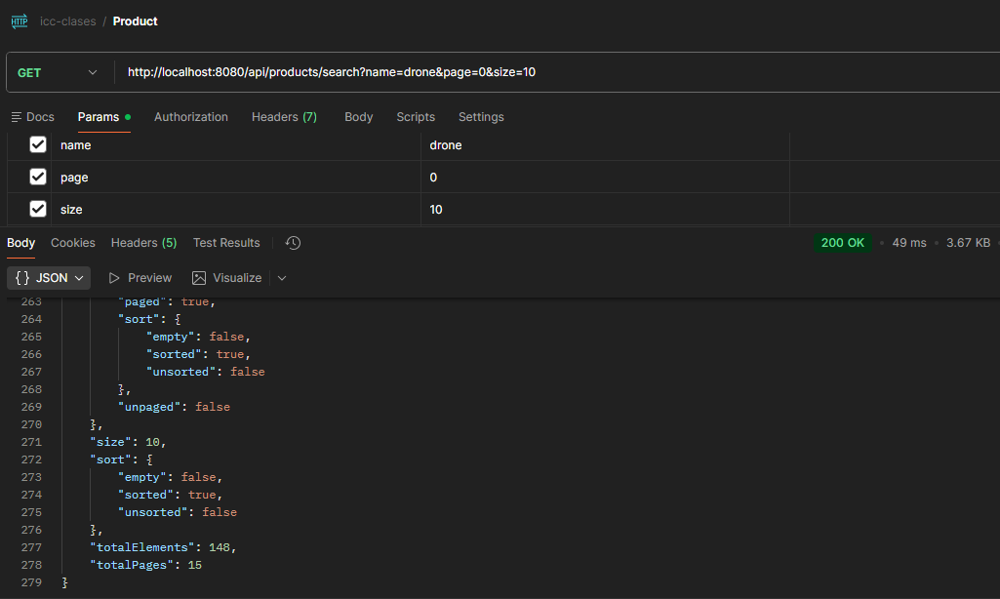
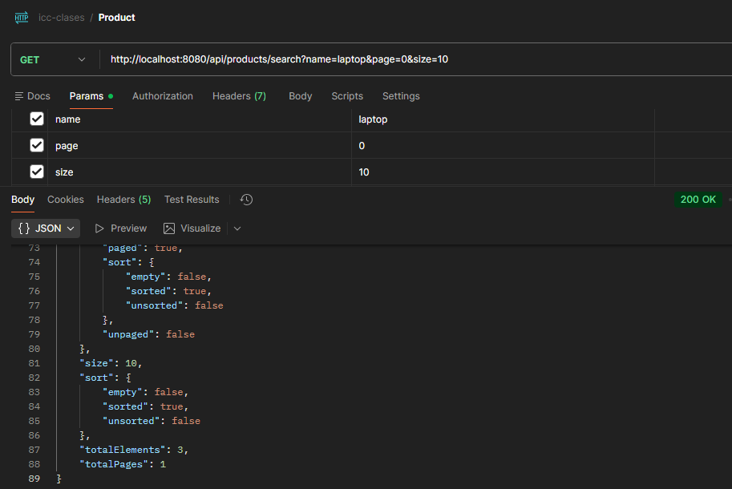

# **Spring Boot – Paginación de Datos con Spring Data JPA: Optimización y User Experience**

# **9. Resultados y Evidencias Requeridas**

## **9.1. Datos para revisión**

**Usar un dataset de al menos 1000 productos**:
Crear un script de carga masiva para poblar la base de datos con datos variados:
- al menos 5 usuarios
- alemnos 2 categorias por producto  
- Precios variados ($10 - $5000)
- Nombres con texto buscable

## **9.2. Evidencias de funcionamiento** Caputuras de Postman Bruno o similar mostrando respuestas correctas
1. **Page response**: `GET /api/products?page=0&size=5` mostrando metadatos completos
.png)
2. **Slice response**: `GET /api/products/slice?page=0&size=5` sin totalElements

3. **Filtros + paginación**: `GET /api/products/search?name=laptop&page=0&size=3`

4. **Ordenamiento**: `GET /api/products?sort=price,desc&page=1&size=5`

## **9.3. Evidencias de performance**
1. **Comparación**: Tiempos de respuesta Page vs Slice

**Consultas de prueba con volumen**: para cada uno Page y Slice
1. Primera página de productos (page=0, size=10)

2. Página intermedia (page=5, size=10) 

3. Últimas páginas para verificar performance

4. Búsquedas con pocos y muchos resultados

5. Ordenamiento por diferentes campos

# **10. Conclusiones**

Esta implementación de paginación en Spring Boot demuestra:

* **Paginación nativa**: Uso completo de Spring Data JPA Pageable
* **Flexibilidad**: Page vs Slice según necesidades de performance
* **Integración**: Filtros + paginación + ordenamiento en una sola consulta
* **Escalabilidad**: Funciona eficientemente con millones de registros
* **Usabilidad**: APIs REST estándar con metadatos completos
* **Performance**: Consultas optimizadas con índices apropiados